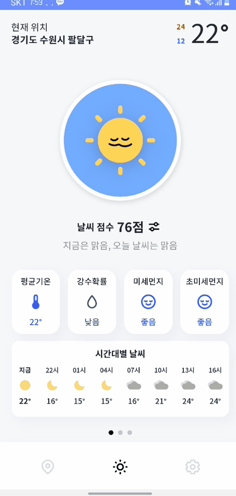
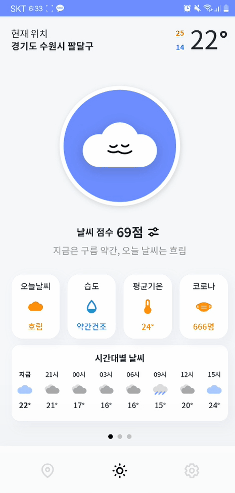
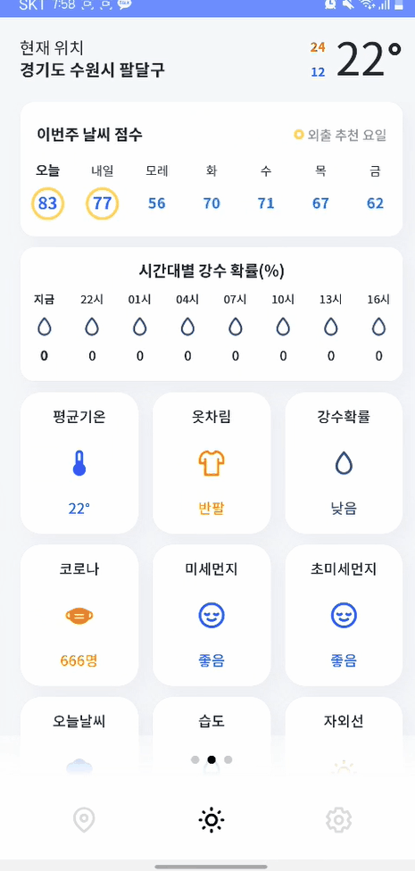
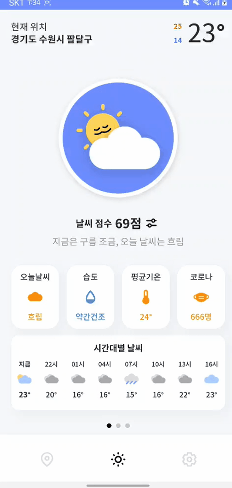
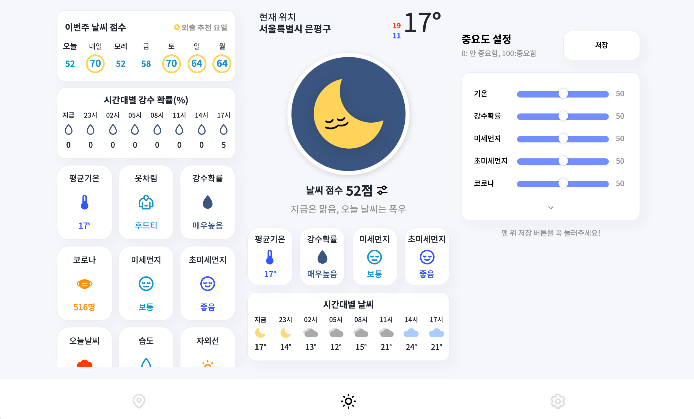
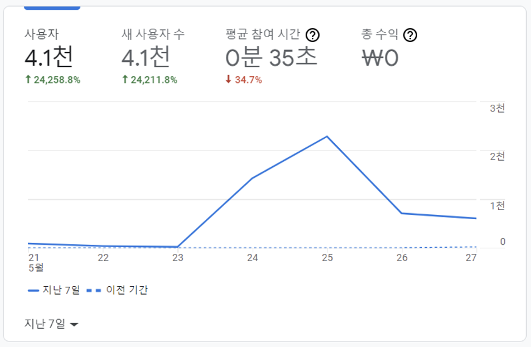

# weather_level


🎬 [유튜브 링크](https://www.youtube.com/watch?v=WWQWBb_dLu0)
	- 날씨 정보를 받아오는 일부 open API 서비스 종료로 인해 개발 중단합니다. 영상 참고 부탁드립니다!

📁 [백엔드 Repository 링크](https://github.com/joychae/SpringBoot-Project-WeatherService)

📕 [팀 노션](https://www.notion.so/2004f97193f04be080e06e08898dfa9b)

**weather_level 프로젝트의 프론트 엔드 Repository 입니다.**

## 목차

[1. 개요](#개요)

[2. 프로젝트 특징](#프로젝트-특징)

[3. 사용 패키지](#사용-패키지)

[4. 핵심 트러블 슈팅](#핵심-트러블-슈팅)

[5. Contents](#Contents)

[6. 고객 반응 및 성과](#고객-반응-및-성과)

## 개요

- 명칭 : weather level (외출 난이도)
- 개발 인원 : 6명
  - Front end: **전재민, 조윤경**
  - Back end: **채수연, 강상연, 김동현**
  - Designer: **공은지**
- 개발 및  기간 : 2021.04.23 ~ 2022.07.04
  - 날씨 정보를 받아오는 일부 open API 서비스 종료로 인해 개발 중단합니다.🙏
- 주요 기능
  - 사용자의 선호도를 토대로 알고리즘을 통해 날씨 점수 출력
  - 날씨 정보 큐레이팅
- 개발 언어 : JavaScript, TypeScript
- 개발 라이브러리 : React.js
- 형상 관리 툴 : git
- 협업 툴 : [notion](https://www.notion.so/2004f97193f04be080e06e08898dfa9b), [구글 스프레드 시트](https://docs.google.com/spreadsheets/d/1Wbv10czlXBtes6mJF3kTe4gOyI3SjJDe1Q8nZSkBa2A/edit#gid=0), 구글 드라이브
- 간단 소개 : 리액트 - 스프링 협업의 날씨 정보 제공 서비스

## 프로젝트 특징

- weather level (외출 난이도)

  - 날씨 정보와 사용자의 선호도를 토대로, 알고리즘을 통해 날씨 점수를 제공하는 서비스
  - 직관적이고 알아보기 쉬운 날씨 정보 큐레이팅
- 프론트엔드와 백엔드를 분리하여 프로젝트 개발

  - 각 파트별로 Repository를 생성 후 작업
  - 프론트: AWS S3, Cloud Front
  - 백엔드: AWS EC2
  - 빌드 후, S3와 EC2를 연동
    - API 명세서에 따라 API호출 및 응답 확인
  - HTTPS 통신
    - SSL 인증서 적용
- 사용자의 현재 GPS 정보를 기반으로한 날씨 정보 제공

  - 사용자가 원하는 지역 선택 가능
- 사용자가 설정한 우선순위에따라서 날씨 정보 카드를 우선적으로 보여줌
- 카카오톡으로 자신의 오늘 날씨 점수를 공유
- 뉴모피즘과 귀여운 날씨 캐릭터가 가미된 UI
- 반응형 디자인

  - 포터블 모드: 주요 모델 지원 UI
  - 데스크탑 모드: 데스크탑 환경에서 한눈에 볼 수 있는 UI
- PWA

  - Progressive Web Apps
  - Lighthouse 조건을 충족
  - 안드로이드 -크롬, iOS - 사파리에서 홈 화면에 바로가기 설치 가능
  - 안드로이드 플레이 스토어 배포 예정

- 사용자의 현재 GPS 정보를 기반으로한 날씨 정보 제공


## 사용 패키지

* **reduxjs/toolkit**
  - 데이터 전역 관리를 위한 리덕스 관리 패키지
* **styled-components**
  - 컴포넌트의 스타일을 설정하는 패키지
* **axios**
  - 서버 통신을 위한 패키지
* **connected-react-router, history**
  - 라우팅 및 페이지 이동을 위한 패키지
* **react-spinners**
  - 로딩 화면(스피너)를 구현하는 패키지
* **swiper**
  - 슬라이더를 구현하는 패키지
* **workbox**
  * serviceworker를 다루는 패키지
* **eslint, prettier**
  * 코드 컨벤션을 적용하기 위한 패키지

## 핵심 트러블 슈팅

🚀 [더 많은 트러블 슈팅](https://www.notion.so/43dedf827ea94022bbfc01b87c57e0c9)

### range event 버블링
- 세번째 슬라이더에서 range를 조절할 때 슬라이더가 같이 움직여버리는 이슈
- onChange에 stopPropagation을 넣어도 해결이 안 되었음
- touchstart 이벤트 제어를 위해서 바닐라 자바스크립트를 활용
- Range를 감싸는 요소에 className 부여

```jsx
<RangeWrapper
        className="wrapper"
      >
        {rangeList}
        <ShowButton onClick={handleRangeHidden}>
          {isHidden ? <MdKeyboardArrowDown /> : <MdKeyboardArrowUp />}
        </ShowButton>
      </RangeWrapper>
```

- 터치이벤트 버블링 방지 함수 정의

```jsx
const stopTouchStart = (e) => {
    e.stopPropagation();
  }
```

- useEffect에서 eventListener 처리

```jsx
React.useEffect(() => {
    // RangeWrapper
    const wrapper = document.querySelector('.wrapper');
    wrapper.addEventListener('touchstart', stopTouchStart);
    return () => {
      wrapper.removeEventListener('touchstart', stopTouchStart)
    }
  }, [])
```

### 말풍선 setTimeout 관련 이슈
- 팝업을 여러번 클릭했을 때 마지막 클릭이 3초간 유지가 안됨

- clearTimeout 관련 문제라고 생각함
- 실패1. clean up 함수 안에서 clearTimout ->  Score 컴포넌트 안에 SpeechBubble이라는 컴포넌트를 온클릭 했을 때 조건부 렌더링으로 노출시키는 상황이라 clean up이 Bubble 컴포넌트가 생기고 사라질 때도 일어남
- 실패2. Score.tsx에서 setTimer을 let 변수로 선언하고 onClick 할 때 clearTimeout을 한다. 
실패!!! timer console을 찍을 때 undefined가 나옴. 리렌더링 되면서 timer는 사라지고 비동기만 돌아가는 듯함
```tsx
const Score = (props)=>{
	let timer ;

	const onClickLogo = () => {
    console.log(timer);
    clearTimeout(timer);

    dispatch(weatherActions.getIconMessage(nowIcon));

    setIsShowBubble(true);

    timer = setTimeout(() => {
      setIsShowBubble(false);
    }, 3000);

  };

	...
}

```
- 해결 : setTimeout을 useState로 관리
```tsx
const [timerState, setTimerState] = useState(null);

  const onClickLogo = () => {
    clearTimeout(timerState);

    dispatch(weatherActions.getIconMessage(nowIcon));

    setIsShowBubble(true);

    const timer = setTimeout(() => {
      setIsShowBubble(false);
    }, 3000);
    setTimerState(timer);
  };
```
### 빌드가 실시간 적용이 안되는 문제
- 수정을 하고 새로 배포했을 때, 수정사항이 반영되지 않음
- cloud front 캐시 문제
[CloudFront에서 특정 파일 캐시 방지](https://aws.amazon.com/ko/premiumsupport/knowledge-center/prevent-cloudfront-from-caching-files/)


### swiper index 이슈

- swiper index 이슈

  - 메인컨텐츠에서 preference를 조절하고 저장 이후 첫 슬라이더로 이동이 되었으면 좋겠다는 피드백
  - 카드 상세 페이지에서 이전 버튼 클릭 시 무조건 첫 번째 인덱스로만 보여주는 문제
  - 설정페이지, 지역 설정 페이지에서 다시 메인으로 돌아갔을 때 무조건 첫 번째 인덱스로 보여주는 문제

  

  1. swiper 객체 생성

     ```jsx
     ...
     // swiper 객체를 생성하기 위한 useState
     const [swiper, setSwiper] = useState(null);
     // Swiper의 onSwiper props로 setSwiper를 넘기면 객체 생성
     ...
     <Swiper
               pagination={{ clickable: true }}
               className="swiper"
               onSwiper={setSwiper}
               style={{
                 width: '100%',
                 height: '80%',
               }}
               onSlideChange={onSwiper}
             >
     ...
     ```

  2. moveCurrentSlide 선언 후 Presetting 컴포넌트에 moveToMain props로 넘기기

     - 저장 버튼을 클릭시 넘겨 받은 moveToMain props의 함수 실행
     - preference 저장 시, 0번 인덱스(처음)으로 이동

     ```jsx
     // 슬라이더 인덱스 이동
       const moveCurrentSlide = (idx) => {
         swiper.slideTo(idx, 250, true);
         swiper.slideReset();
       };
     ...
     <SwiperSlide>
     ...
     // 
     <PreSetting isMain moveToMain={() => moveCurrentSlide(0)} />
     ...
     </SwiperSlide>
     ```

  3. slider의 index를 저장하는 모듈 생성

     ```jsx
     // slider.ts
     
     // 슬라이더의 인덱스를 받아오는 액션
     const setSliderIndex = createAction<unknown>('slider/SET_SLIDERINDEX');
     
     const slider = createReducer(initialState, {
       [setSliderIndex.type]: (state: sliderType, action: PayloadAction<number>) => {
         state.curIndex = action.payload;
       },
     });
     
     export const sliderActions = {
       setSliderIndex,
     };
     
     export default slider;
     ```

  4. 현재 슬라이더를 인덱스 스토어에 저장하는 함수 선언(Main.tsx)

     ```jsx
     // 현재 슬라이더 인덱스 스토어에 저장
       const onSwiper = (swiper) => {
         dispatch(sliderActions.setSliderIndex(swiper.realIndex));
       };
     ```

  5. Swiper의 onSlideChage props에 onSwiper 넘기기

  - 슬라이드가 될 때마다 onSwiper 실행

  ```jsx
  ...
  <Swiper
            pagination={{ clickable: true }}
            className="swiper"
            onSwiper={setSwiper}
            style={{
              width: '100%',
              height: '80%',
            }}
            onSlideChange={onSwiper}
          >
  ...
  ```

  6. Main.tsx가 렌더링 되었을 때 해당 인덱스로 이동시키기

  ```jsx
  // swiper 객체가 생겼을 때 실행
    useEffect(() => {
      if (swiper) {
        moveCurrentSlide(curIndex);
      }
    }, [swiper]);
  ```

  ## Reference

  [Swiper API](https://swiperjs.com/swiper-api#methods-and-properties)


## Contents

### 사용 예시(스마트폰)














### 반응형 디자인 (태블릿)




## 고객 반응 및 성과

 **24일 (Release Day) 이후 4일간 구글애널리틱스 기준 사용자 4100명 달성**




